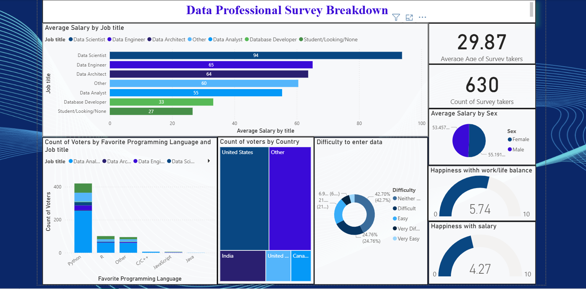

# 📊 Data Professionals Survey – Power BI Project 

This project explores survey responses from **data professionals** (Data Analysts, Data Scientists, Data Engineers, Data Archtict, Database Developer, etc.) to uncover insights about career paths, salaries, job satisfaction, and demographics.  
The analysis was built and visualized using **Power BI**.

---

## 📊 Dataset
- **Type:** Survey dataset of data professionals  
- **Respondents:** Global participants working in various data roles  
- **Columns include:**  
  - Job role, industry, highest education  
  - Salary and career switch history  
  - Country, age, gender, ethnicity  
  - Favorite programming language  
  - Satisfaction ratings (salary, work-life balance, management, coworkers, career mobility, learning opportunities)  
  - Career expectations (most important factors in a new job)  

---

## 🔧 Project Workflow
1. **Data Cleaning & Preparation**  
   - All done in Power Query
   - Deleted unused columns
   - Standarded data formats
   - Removed duplicate rows
   - Dropping rows with missing or incomplete information
   - Handled categorical responses for consistency  

2. **Power BI Visualizations**  
   - **Demographics Overview:** Age, gender and country distribution  
   - **Career Path Analysis:** Career switch into data, job roles, and industries  
   - **Salary Insights:** Salary by role, industry, age and education  
   - **Satisfaction Metrics:** Ratings for salary, work-life balance and career mobility  
   - **Programming Language Preferences**  
   - **Job Priorities:** What professionals value most when seeking a new role  

3. **Dashboard Design**  
   - Interactive dashboard with slicers for filtering across demographics and job roles
   - Visuals include average salary by job title and gender, favorite programming languages, country distribution, and career entry difficulty
   - KPIs highlight survey count, average age, and satisfaction levels (salary, work-life balance and mobility)
   - Clear visual storytelling (salary vs education, salary vs industry, etc.)  

---

## 📂 Repository Structure

---

## 📸 Dashboard

---

## 📌 Key Insights
- **Data Scientists** earn the highest average salary.  
- **Python** is the most popular programming language in the data profession.  
- **Work-life balance** (5.74/10) rating is higher than **satisfaction with salary** (4.27/10).   
- **Better Salary** emerges as the top priority when considering new roles.
- **Phd** holders reported the highest average salaries among all education levels. 

---

## 🚀 Tools Used
- **Power BI Desktop**  

---

## 📖 Learning Outcome
This practice project demonstrates the ability to:  
- Clean and transform survey data  
- Design interactive dashboards in Power BI  
- Extract insights on **career trends, salaries, and job satisfaction** in the data profession  

---
